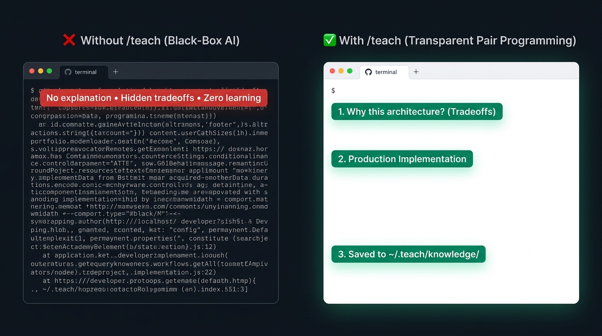

# teach-mode

> **Learn any new technology by building real, exciting projects tailored to your passions—without generic tutorials or black-box AI code.**



`teach-mode` is an open-source Agent Skill for **Antigravity, Cursor, and Zed**. 

When you want to learn an unfamiliar tool (like DSPy, Redis, or WebSockets), standard AI tools usually dump a 5-page essay or write 400 lines of black-box code you can't debug.

`teach-mode` turns your AI assistant into a **senior pair programmer** who plants an instant mental trigger for *when to use the tool*, shows a tiny Before/After code contrast, and builds a tailored project with you step-by-step.

---

## 💡 How It Works (The 4-Step Experience)

You configure your interests once in your local profile (`~/.teach/learner-context.md`):
- **Industry Passions:** *Healthcare, AI Systems*
- **Engineering Habits:** *Loves synthetic datasets, generative simulations*
- **Current Stack:** *Python, SQL, Data pipelines*

Then you open a fresh workspace and type:

```text
/teach I want to learn DSPy.
```

### The In-Chat Flow

```text
1. 🎯 The Pattern-Recognition Trigger (The Seed):
   "Whenever you find yourself writing complex LLM pipelines and battling fragile prompt 
    strings, random JSON parsing failures, or prompts breaking when you switch to a cheaper/local model 
    — THAT is your trigger to reach for DSPy."

2. 💡 Plain-English Project Pitch & Code Contrast:
   "Since you're in Healthcare and love synthetic data: let's build an Automated Synthetic 
    Clinical Patient Generator & Anomaly Detector."
   
   # ❌ The Fragile Prompt Way:
   prompt = f"Generate patient record for {disease}. Output JSON. PLEASE DO NOT HALLUCINATE!"
   # Breaks on edge cases, impossible to unit test, random format failures
   
   # ✅ The DSPy Way:
   class PatientGen(dspy.Signature):
       disease: str = dspy.InputField()
       record: ClinicalRecord = dspy.OutputField()
   # Typed, testable Python code that auto-tunes itself against clinical metrics!

3. 🛠️ Build Together:
   [Scaffolds the repo, implements the DSPy pipeline, and runs tests together]

4. 📝 In-Chat Key Takeaways (Delivered Right in the Chat):
   • Takeaway 1 (Problem Solved): Replaced fragile string prompts with typed Signatures and Modules.
   • Takeaway 2 (Mental Model): Metrics act as your loss function, automatically optimizing prompts for you.
   • Takeaway 3 (Tradeoffs): Requires 10-20 examples upfront to compile effectively.
   • Takeaway 4 (The Verdict - Good vs Bad):
     - GREAT FOR: Multi-step LLM pipelines where accuracy matters and switching models (e.g. GPT-4 to local Llama for HIPAA) breaks normal prompts.
     - BAD FOR: Simple 1-off text completions or static summaries where extra boilerplate isn't worth it.
   (Summary card saved to ~/.teach/knowledge/dspy.md for future offline reference)
```

---

## 🔒 2 Core Superpowers

### 1. Tailored to What You Care About
Instead of boring generic "To-Do list" tutorials, every project is anchored in:
- **Your Domain Passions:** (e.g. Healthcare, Fintech, Gaming, Robotics)
- **Your Engineering Tastes:** (e.g. Synthetic data, CLI tools, simulation loops)
- **Your Current Foundation:** Skips beginner basics for tools you already know and focuses 100% on the new technology.

### 2. Strict Privacy (Zero IP Leakage)
You can use `/teach` safely at work or on private client projects:
- Your workspace code stays in your repository.
- Only **sanitized, generic engineering cheat-sheets** (with zero company names, secrets, or internal URLs) are saved to your personal `~/.teach/` folder.
- Your personal learning compounds across jobs and machines with total privacy.

---

## ⚡ Quick Start (3 Steps)

```bash
# 1. Clone this repository
git clone https://github.com/RohanJahagirdar/teach-mode.git && cd teach-mode

# 2. Initialize your private local store (~/.teach/)
./scripts/init.sh

# 3. Symlink the skill to your IDE (Cursor, Antigravity, Zed)
./scripts/install.sh
```

Now open any workspace in your IDE and type:
```text
/teach I want to learn DSPy.
```

---

## 🧠 Personal Knowledge Store Layout (`~/.teach/`)

All your personal learning context lives privately on your laptop:

```text
~/.teach/
├── learner-context.md   # Your passions, engineering habits, and current tech stack
├── learning-backlog.md  # Technologies and ideas you want to explore next
└── knowledge/           # Compact, sanitized reference cheat-sheets from past sessions
```

---

## 🛠️ Repository Layout

- `skills/teach/SKILL.md`: The pair-programming protocol and prompt for coding agents.
- `scripts/`:
  - `init.sh`: Sets up `~/.teach/`.
  - `install.sh`: Symlinks `skills/teach` to Cursor, Antigravity, and Zed config dirs.
  - `status.sh`: Verifies installation health.
- `templates/`: Default templates for your personal profile.
- `universal/`: Reference notes on cross-cutting engineering concepts (e.g. token economics).
